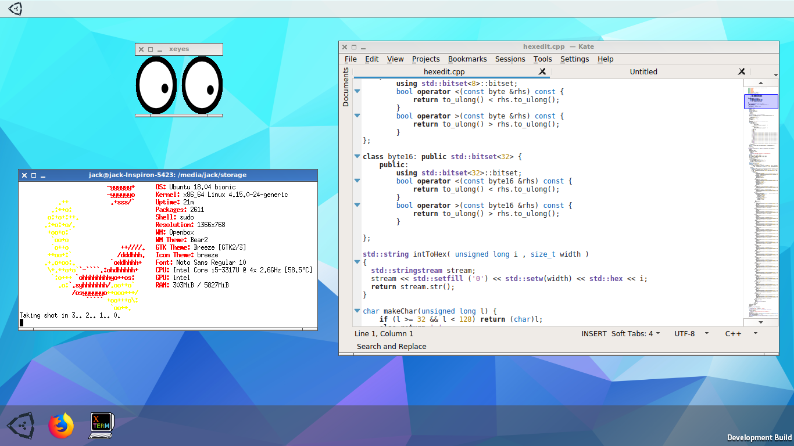

# Unity2DE
Unity2DE is a desktop manager for Linux that uses the [Unity](https://unity3d.com) engine.

## Features
* Launcher shows all of your apps
  * Apps can be added inside the launcher
  * Specify name, path, icon, and arguments (if needed)
* Quick-launch applications from the dock
  * Just drag them from the launcher into the dock
  * If you don't want it, just drag it out
* Wallpaper easily changeable from the main menu (PNG only right now)

## Requirements
* 64-bit Linux (unless you build it yourself)
* GPU that supports OpenGL 3.2+ or Vulkan
* Preexisting window manager such as Openbox (Unity2DE doesn't have a window manager yet)

### Build requirements
* Unity Editor 2018.2.1f1 (any platform)
* Plenty of free space (in the GB's)

## Building
Open the project in the Unity editor (I think in `Assets/Scenes/SampleScene.unity`?) and go to "File" -> "Build Settings...". Then select "PC, Mac & Linux Standalone" and choose the platform and architecture, as well as other settings. Then hit "Build" and choose the destination to place the build files.

## Running
`cd` to the build folder, then run in a shell:
    
    xinit openbox &
    sleep 1
    DISPLAY=:0 ./Unity2DE.x86_64
Replace `openbox` and `x86_64` with the window manager and architecture, respectively.
